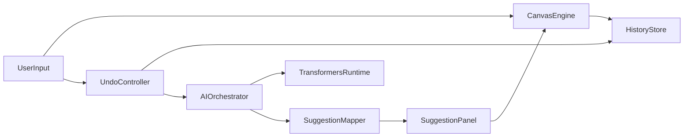

<!-- df21b5a2-393b-4a63-9392-d3af92af304d -->
---
todos:
  - id: "scaffold-svelte-core"
    content: "Set up Svelte + TypeScript project with perfect-freehand, transformers.js, and lucide-svelte dependencies."
    status: pending
  - id: "build-canvas-history"
    content: "Implement performant stroke capture/rendering and undo history primitives."
    status: pending
  - id: "ipad-fullscreen-input"
    content: "Add iPad-oriented fullscreen UX and stylus/undo input bridge with fallback triggers."
    status: pending
  - id: "ai-undo-suggestions"
    content: "Integrate client-side model runtime and generate 5 structured undo alternatives on each undo event."
    status: pending
  - id: "right-panel-apply-flow"
    content: "Build right suggestion panel and wire suggestion selection to deterministic redraw insertion."
    status: pending
  - id: "test-and-harden"
    content: "Add flow tests and fallback/performance guardrails for stable iPad usage."
    status: pending
isProject: false
---
# Svelte iPad AI Canvas MVP Plan

## Goal
Ship a first MVP of a clean, modern drawing web app inspired by tldraw aesthetics, optimized for iPad performance and touch/stylus UX, with an AI-assisted undo flow.

## Product Scope (MVP)
- Canvas drawing with smooth freehand strokes using `perfect-freehand`.
- iPad-friendly interaction model (touch + stylus focus, gesture-safe controls).
- Fullscreen entry on iPad to feel app-like.
- Undo action trigger (including Pencil double-tap mapping where browser/device allows it, with reliable in-app fallback trigger).
- On each undo, run a small on-device Transformers.js model to generate **5 structured redraw suggestions**.
- Show 5 suggestions in a right-side panel; tapping one inserts/draws that suggestion on canvas.
- Suggestions are ephemeral per undo event (new undo => new set).

## Dependency Version Policy
- Use the latest stable versions at implementation time for:
  - `svelte`, `vite`, `typescript`
  - `perfect-freehand`
  - `@xenova/transformers`
  - `lucide-svelte`
- Do not pin legacy versions unless a specific compatibility issue is discovered during build/test.
- Add a validation step early:
  - Verify installed versions and changelog notes for breaking API changes.
  - Adjust integration code to current APIs before feature implementation continues.

## Technical Architecture

## Implementation Plan

### 1) App scaffold and baseline performance
- Initialize Svelte app (Vite) with TypeScript.
- Add core deps: `perfect-freehand`, `@xenova/transformers`, `lucide-svelte`.
- Install all dependencies at latest stable releases at setup time.
- Build a minimal shell layout with a fixed canvas area and right suggestion panel.
- Establish performance constraints early:
  - Pointer event handling with minimal reactive churn.
  - RequestAnimationFrame-based draw scheduling.
  - Avoid heavy object reallocations in hot stroke paths.

Planned key files:
- [src/App.svelte](src/App.svelte)
- [src/lib/canvas/CanvasSurface.svelte](src/lib/canvas/CanvasSurface.svelte)
- [src/lib/state/history.ts](src/lib/state/history.ts)

### 2) Drawing engine with `perfect-freehand`
- Capture pointer/stylus points and convert to smooth stroke outlines.
- Render stroke paths on canvas/SVG (pick one optimized path; likely canvas for throughput).
- Implement data model for strokes and deterministic replay.
- Add undo/redo stack primitives and immutable history snapshots.

Planned key files:
- [src/lib/canvas/strokeModel.ts](src/lib/canvas/strokeModel.ts)
- [src/lib/canvas/freehand.ts](src/lib/canvas/freehand.ts)
- [src/lib/state/history.ts](src/lib/state/history.ts)

### 3) iPad UX and fullscreen behavior
- Add explicit fullscreen control with graceful fallback when browser blocks fullscreen.
- Tune touch-action and gesture behavior to reduce accidental page scrolling/zoom.
- Add “native-like” minimal chrome mode for tablet.
- Implement “Pencil double-tap intent” abstraction:
  - Primary path: platform/browser event hooks when available.
  - Fallback path: dedicated undo control/gesture producing identical behavior.

Planned key files:
- [src/lib/ipad/fullscreen.ts](src/lib/ipad/fullscreen.ts)
- [src/lib/ipad/inputBridge.ts](src/lib/ipad/inputBridge.ts)
- [src/lib/ui/TopBar.svelte](src/lib/ui/TopBar.svelte)

### 4) Client-side Transformers.js suggestion pipeline (Option B)
- Load a very small model in-browser (lazy load on first undo or idle prewarm).
- Define a compact structured suggestion schema (e.g. stroke motif + transform params + style hints) that is cheap to parse and deterministic.
- On undo:
  - Extract context from undone stroke(s).
  - Prompt model for 5 alternatives in schema form.
  - Validate and sanitize model output.
  - Map suggestions to concrete stroke commands.
- Keep inference non-blocking (worker/off-main-thread where practical).

Planned key files:
- [src/lib/ai/modelRuntime.ts](src/lib/ai/modelRuntime.ts)
- [src/lib/ai/suggestionSchema.ts](src/lib/ai/suggestionSchema.ts)
- [src/lib/ai/generateUndoSuggestions.ts](src/lib/ai/generateUndoSuggestions.ts)
- [src/lib/ai/suggestionMapper.ts](src/lib/ai/suggestionMapper.ts)

### 5) Suggestion panel UX (right side)
- Build clean right rail panel using Lucide icons and simple cards.
- Show 5 generated options with quick visual previews (thumbnail strokes or textual labels).
- Clicking a suggestion inserts its mapped stroke data onto canvas.
- Clear and regenerate on next undo action.

Planned key files:
- [src/lib/ui/SuggestionPanel.svelte](src/lib/ui/SuggestionPanel.svelte)
- [src/lib/ui/SuggestionCard.svelte](src/lib/ui/SuggestionCard.svelte)
- [src/lib/state/suggestions.ts](src/lib/state/suggestions.ts)

### 6) Reliability, quality, and performance hardening
- Add guardrails for model failures/timeouts (fallback deterministic variations when model unavailable).
- Add tests for:
  - undo event -> 5 suggestions generated
  - suggestion apply inserts valid stroke
  - suggestion set replaced after next undo
- Profile on iPad-targeted conditions and reduce jank (debounce heavy UI updates, cache paths).

Planned key files:
- [src/lib/ai/__tests__/generateUndoSuggestions.test.ts](src/lib/ai/__tests__/generateUndoSuggestions.test.ts)
- [src/lib/state/__tests__/undoSuggestionsFlow.test.ts](src/lib/state/__tests__/undoSuggestionsFlow.test.ts)

## Defaults and decisions applied
- Framework: **Svelte**.
- Drawing core: **perfect-freehand**.
- UI/icons: **Lucide Svelte**.
- AI strategy: **Option B** (structured suggestions mapped deterministically to strokes).
- Licensing: no tldraw SDK usage.

## Milestone outcome
At milestone completion, users can draw on iPad smoothly, trigger undo, receive 5 on-device AI redraw alternatives in a right-side panel, and apply any suggestion back onto the canvas with low-latency interaction.

